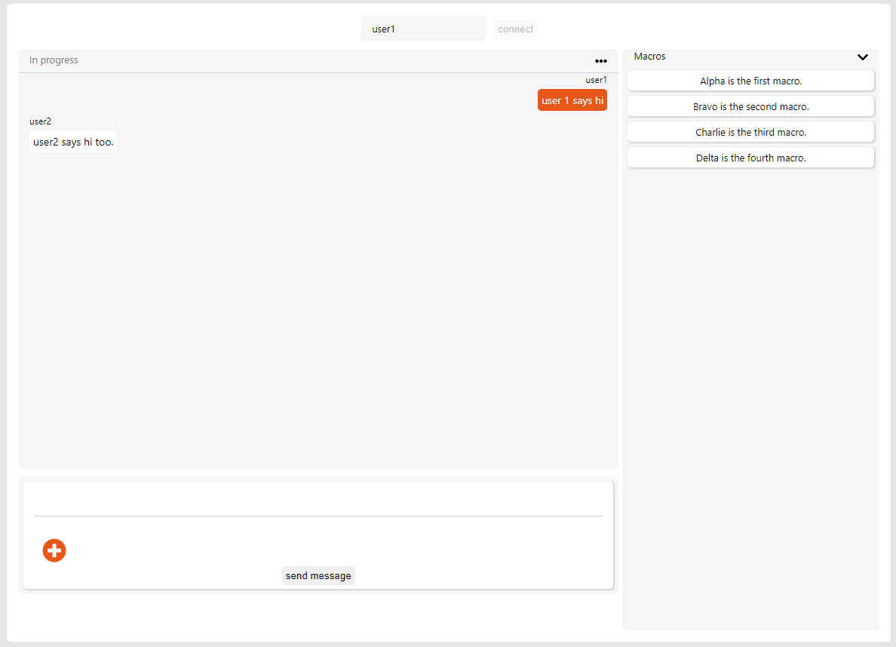

# Chat App Front End code for Cartloop evaluation

This project was bootstrapped with [Create React App](https://github.com/facebook/create-react-app).

## Available Scripts

In the project directory, you can run:

### `npm start`

Runs the app in the development mode.\
Open [http://localhost:3000](http://localhost:3000) to view it in the browser.

The page will reload if you make edits.\
You will also see any lint errors in the console.

### `npm test`

Launches the test runner in the interactive watch mode.\
See the section about [running tests](https://facebook.github.io/create-react-app/docs/running-tests) for more information.

### `npm run build`

Builds the app for production to the `build` folder.\
It correctly bundles React in production mode and optimizes the build for the best performance.

The build is minified and the filenames include the hashes.\
Your app is ready to be deployed!

See the section about [deployment](https://facebook.github.io/create-react-app/docs/deployment) for more information.

# Environment configuration
Server endpoint can be changed by using the REACT_APP_SERVER_ENDPOINT variable to switch URLs.

# Usage
Run npm install from the terminal to install all required dependencies. Subsequent run and build commans would launch and build the app.

# Mode of operation

This app requires a server running with a socket.io connection. The link can be found at

Upon screen load, type in the username and press connect. This will initiate a socket connection to the server.
Post that any message entered in the text section below can be sent via clicking the send message button.

The core messaging functionality works and any additional functionality with respect to smileys, macros and message persistence are not implemented and are only visually representative.

